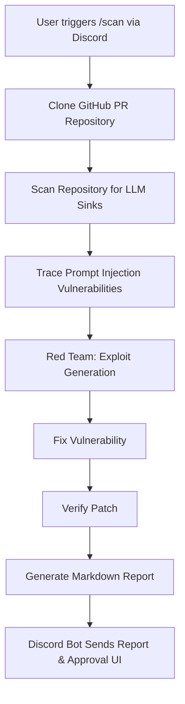

# Injection Sentinel

Production-quality prompt injection detection and remediation system built for OpenSwarm.

## Problem Statement

As Large Language Models (LLMs) are increasingly integrated into software applications, they introduce new security vulnerabilities. The most prominent of these is the **Prompt Injection** attack, where malicious user inputs trick the model into ignoring instructions or leaking sensitive data. Detecting and remediating these vulnerabilities during the development lifecycle (before they are merged into production) is critical but challenging due to the dynamic and unpredictable nature of LLM interactions.

## Solution

**Injection Sentinel** provides an automated, multi-agent AI pipeline designed to secure codebases against prompt injection vulnerabilities. Integrated directly as a Discord bot, it automatically:
- Scans GitHub Pull Requests for potential LLM sinks.
- Traces the data flow from user inputs to model prompts.
- Employs a Red Team agent to generate malicious payloads and confirm exploitability.
- Suggests fixes to sanitize inputs or isolate instructions.
- Verifies the applied patches and generates a comprehensive security report.

## Architecture



## Output

Below are examples of Injection Sentinel in action:


<p align="center">
  <em>Running the <code>/scan</code> command to analyze a repository via the Discord interface.</em>
</p>


<p align="center">
    <em>The final security report detailing the detected vulnerability, the generated exploit, and the recommended fix.</em>
</p>


## Installation & Setup

Follow these steps to run Injection Sentinel locally and connect it to your own Discord server.

### Prerequisites

- **Python 3.10+**
- **Git** installed and available on your PATH
- A **Discord account** with permissions to create a bot
- An **OpenRouter API key** (or compatible OpenAI-format key)

---

### 1. Clone the Repository

```bash
git clone https://github.com/arnav-eluri/openswarm_hackathon_zeroday.git
cd openswarm_hackathon_zeroday
```

### 2. Install Dependencies

```bash
pip install -r requirements.txt
pip install python-dotenv   # required for loading .env
```

### 3. Configure Environment Variables

Create a `.env` file in the project root (or copy the template):

```bash
cp .env.example .env   # if an example file exists, otherwise create manually
```

Edit `.env` and fill in your credentials:

```env
DISCORD_TOKEN=your_discord_bot_token_here
OPENROUTER_API_KEY=your_openrouter_api_key_here
```

| Variable | Where to get it |
|---|---|
| `DISCORD_TOKEN` | [Discord Developer Portal](https://discord.com/developers/applications) → Your App → **Bot** → **Token** |
| `OPENROUTER_API_KEY` | [openrouter.ai/keys](https://openrouter.ai/keys) |

### 4. Create & Invite Your Discord Bot

1. Go to the [Discord Developer Portal](https://discord.com/developers/applications) and click **New Application**.
2. Navigate to **Bot** → enable **"Message Content Intent"** and **"Server Members Intent"**.
3. Copy your **Bot Token** and paste it into `.env` as `DISCORD_TOKEN`.
4. Go to **OAuth2 → URL Generator**, select the `bot` and `applications.commands` scopes, then select the `Send Messages` and `Use Slash Commands` bot permissions.
5. Open the generated URL in your browser to invite the bot to your server.

### 5. Run the Bot

```bash
python discord_bot.py
```

You should see:
```
✅ Slash commands synced!
✅ Logged in as InjectionSentinel#XXXX
```

---

## Usage

Once the bot is running and invited to your server:

1. In any channel, type the `/scan` slash command.
2. Paste a **GitHub Pull Request URL** as the argument (e.g., `https://github.com/owner/repo/pull/42`).
3. The bot will clone the repository and run the full multi-agent pipeline:
   - 🔍 Scans for LLM sinks
   - 🕵️ Traces data flow from user inputs to model prompts
   - 💣 Red-teams with generated malicious payloads
   - 🔧 Suggests and applies fixes
   - ✅ Verifies the patch
4. A **security report embed** is posted with **Approve / Reject** buttons for human-in-the-loop review.

> **Tip:** The bot works best on Python-based repositories that make calls to LLM APIs (OpenAI, Anthropic, etc.).

---

## Contributors

Arnav Eluri  <a href="https://www.linkedin.com/in/arnav-eluri"></a> <br>
Ruhi Sharma  <a href="https://www.linkedin.com/in/ruhiisharma/"></a> <br>
Aryan Keshri <a href="https://www.linkedin.com/in/aryan-keshri-/"></a>

