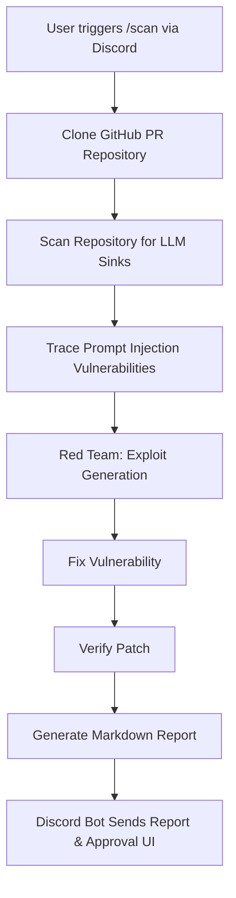
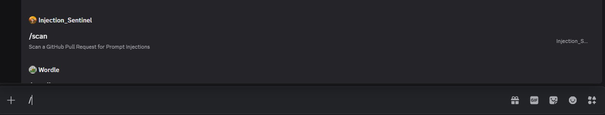
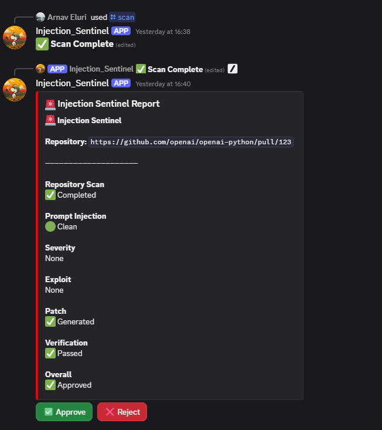

# Injection Sentinel

Production-quality prompt injection detection and remediation system built for OpenSwarm.

## Problem Statement

As Large Language Models (LLMs) are increasingly integrated into software applications, they introduce new security vulnerabilities. The most prominent of these is the **Prompt Injection** attack, where malicious user inputs trick the model into ignoring instructions or leaking sensitive data. Detecting and remediating these vulnerabilities during the development lifecycle (before they are merged into production) is critical but challenging due to the dynamic and unpredictable nature of LLM interactions.

## Solution

**Injection Sentinel** provides an automated, multi-agent AI pipeline designed to secure codebases against prompt injection vulnerabilities. Integrated directly as a Discord bot, it automatically:
- Scans GitHub Pull Requests for potential LLM sinks.
- Traces the data flow from user inputs to model prompts.
- Employs a Red Team agent to generate malicious payloads and confirm exploitability.
- Suggests fixes to sanitize inputs or isolate instructions.
- Verifies the applied patches and generates a comprehensive security report.

## Architecture

## Output

Below are examples of Injection Sentinel in action:

  <em>Running the <code>/scan</code> command to analyze a repository via the Discord interface.</em>

    <em>The final security report detailing the detected vulnerability, the generated exploit, and the recommended fix.</em>

## Contributors

Arnav Eluri    
Ruhi Sharma    
Aryan Keshri 

